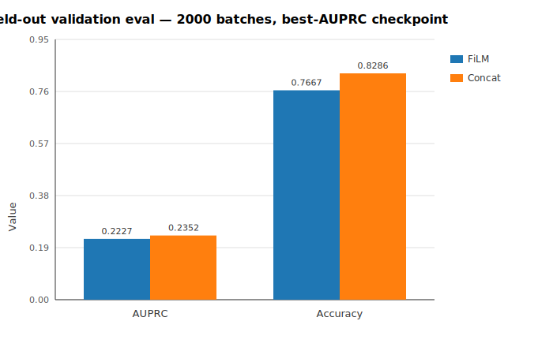
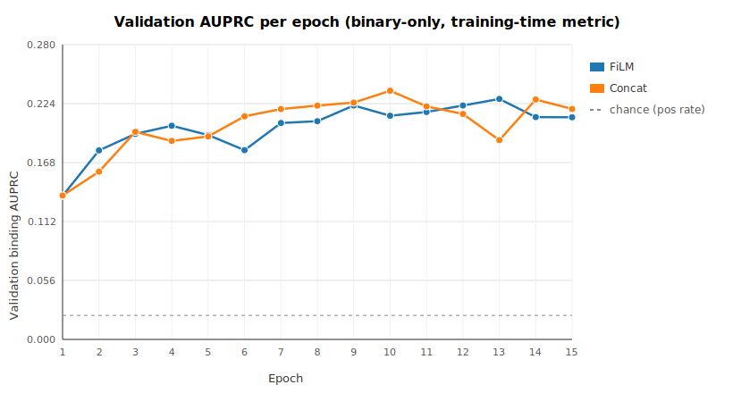
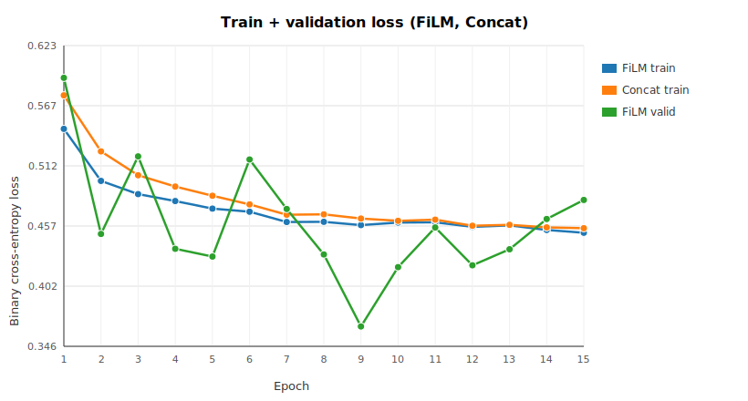

# FiLM vs Concat — binary-only comparison

Run 2026-06-28 on the de.NBI VM (A4000). Direct A/B between the FiLM-conditioned
head ([film.py](../src/mmpartnet/models/film.py)) and the concat-fusion head
([early_fusion.py](../src/mmpartnet/models/early_fusion.py)) on the
binary-only task. Same data, same splits, same hyperparameters, same seed — only
the fusion architecture differs. This is the "does the FiLM mechanism itself
provide value on binary classification?" ablation.

## 1. Headline result

**Concat slightly outperforms FiLM on binary-only validation** (both training-time
history and standalone 2000-batch eval agree).



| Metric (validation) | FiLM   | Concat | Δ (concat − FiLM) |
|---|---:|---:|---:|
| Binding AUPRC      | 0.2227 | **0.2352** | **+0.0125** |
| Binding accuracy   | 0.7667 | **0.8286** | **+0.0619** |
| Binary CE loss     | 0.4557 | **0.3785** | **−0.0772** |
| Positive rate      | 0.0228 | 0.0228 | (identical) |
| n samples          | 64,000 | 64,000 | (identical) |

Numbers above are from the standalone eval on 2000 validation batches using each
run's `best_auprc.pt` checkpoint.

## 2. Setup — identical across both runs

| | Value |
|---|---|
| Task              | `binary-only` |
| Binding labels    | PureClip peaks (`600nt_windows.no-one-hot.stripped.binding.pureclip/dataset.pt`) |
| Tracks            | all (223 RBP × cell tracks matched to a ProtT5 vector) |
| Train windows     | 65,536 (of 512,946 available) |
| Valid windows     | 16,384 (of 116,542 available) |
| Batch size        | 32 |
| Epochs            | 15 |
| Steps/epoch       | 1000 |
| Balanced sampling | 50% positives per batch |
| Optimizer         | AdamW, lr=1e-3 |
| Seed              | 0 |
| RNA encoder       | frozen PARNET body (512-d per position, mean-pooled in both heads before the classifier) |
| Protein encoder   | pooled ProtT5 (1024-d), joined by track→protein map |
| Cell conditioning | learned 32-d embedding (HepG2=0, K562=1) |

**The only difference is how the protein + cell condition acts on the RNA
features.** FiLM produces per-channel γ, β and applies `γ·features + β` positionally;
concat pools RNA to a vector and concatenates it with the protein and cell
vectors before an MLP.

Full run configs live in each run's `metrics.json` under `config`.

## 3. Training curves

Both models train equally well on the train split — train AUPRC reaches ~0.86 for
both by epoch 15. **The gap is on the validation set**, which is what matters.



Concat's validation AUPRC crosses FiLM's from epoch 6 onward and stays ahead.
The best-during-training checkpoints:

| Model  | Best epoch | Train AUPRC (best epoch) | Valid AUPRC (best epoch) |
|--------|-----------:|-------------------------:|-------------------------:|
| FiLM   | 13         | 0.8640                   | 0.2284                   |
| Concat | 10         | 0.8643                   | 0.2363                   |

Concat reaches its ceiling three epochs earlier — consistent with it being the
simpler model.



## 4. Interpretation

### The main finding

**On binary-only, FiLM's per-channel conditioning provides no benefit** on this
data and hyperparameter regime. The simpler concat fusion matches FiLM on training
AUPRC and slightly beats it on all validation metrics (AUPRC, accuracy, loss).

### Why concat can win here

Binary classification asks a **global** question ("does this RBP bind this window
at all?"), not a positional one. Both heads mean-pool the RNA feature over the
600-nt window before the final classifier. Once you've pooled, the per-position
modulation FiLM provides is largely wasted — you've collapsed the position axis.
Concat, by contrast, uses the same pooled representation and lets the MLP mix
RNA, protein, and cell information directly.

FiLM's inductive bias — different RBPs should reweight different RNA channels —
still applies in principle. But on binary-only with mean-pooling, the model can
achieve the same effect through its output layer without needing a dedicated
γ, β pathway.

### The overfit is real for both

Train AUPRC 0.86 vs validation AUPRC 0.23 for both models — that is a large
generalization gap. Both models memorize the balanced-sampled train batches but
transfer only weakly to unbalanced validation windows (positive rate 2.3%).
Adding more regularization, more training data, or a harder negative sampling
strategy is probably worth trying before deciding either architecture is done.

### What this does not mean

- **FiLM is not "worse in general."** The separate profile-only runs got
  Pearson 0.49 on the position-level profile task; FiLM's per-position
  modulation is *designed* for that. This comparison covers only binary-only,
  where FiLM's design advantage is largely neutralized.
- **This is not a zero-shot test.** Train and validation share the same RBPs.
  Clean zero-shot generalization requires the RBP-holdout split + leave-out
  PARNET (see [DATA_INVENTORY.md](DATA_INVENTORY.md) §8).

## 5. Caveats

1. **Single seed.** The Δ AUPRC is +0.0125 — small enough that a 3-seed run
   could change the sign. Before treating "concat > FiLM" as settled, re-run
   with seeds 1 and 2 and report mean ± std.
2. **Only 2000 batches evaluated.** Consistent with the "valid-2000" pattern
   in the FiLM workflow doc. Doubling this would tighten the confidence
   interval but is unlikely to flip the winner.
3. **PureClip labels only.** Both runs use PureClip binding labels; the
   narrowpeak-intersect labels are a different label source. The relative
   ordering may or may not carry over.
4. **In-distribution.** Same RBPs in train and valid — not a generalization
   claim; the whole comparison lives under the leaked all-223 PARNET assumption.

## 6. Recommendations for the team

1. **Report both numbers side-by-side** whenever FiLM binary-only is discussed.
   Concat is now the honest baseline; FiLM must beat it to justify its extra
   parameters on the binary task.
2. **Focus FiLM's justification on profile prediction**, not binary
   classification. The profile-only Pearson 0.49 is where FiLM's
   position-aware conditioning earns its keep.
3. **Multi-seed re-run** (seeds 0, 1, 2) before writing up any headline
   FiLM-vs-concat claim.
4. **Consider a per-RBP AUPRC breakdown.** Pooled 0.23 could hide a bimodal
   distribution (some RBPs at 0.6, most at 0.05). Same eval JSON schema can be
   extended with per-RBP metrics with modest work.

## 7. Reproducing

On the VM:

```bash
cd ~/workspace/ML4RG_mmparnet

# train (in tmux — takes hours per run)
bash scripts/train_film_binary.sh 2>&1 | tee logs/film_binary.log
bash scripts/train_concat_binary.sh 2>&1 | tee logs/concat_binary.log

# eval (fast, no training)
bash scripts/eval_film_binary.sh
bash scripts/eval_concat_binary.sh
```

Result files:

```
/mnt/storage1/ml4rg26-mmparnet/ML4RG_mmparnet/results/film_multitask/
  compare_film_binary_seed0/
    metrics.json                              # training history
    best_auprc.pt                             # weights
    eval_valid_2000_best_auprc.json           # stable eval numbers
  compare_concat_binary_seed0/
    metrics.json
    best_auprc.pt
    eval_valid_2000_best_auprc.json
```
