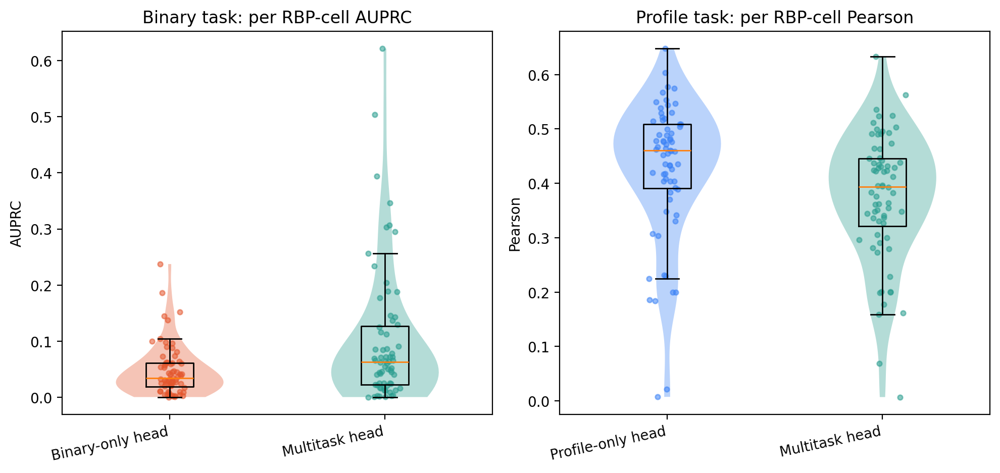

# Cross-Attention Head Comparison on Common-68 RBP-Cell Tracks

This document summarizes the cross-attention task comparison on the 68 shared
RBP-cell tracks using 15,000 test windows. The purpose is to compare the
profile-only, binary-only, and multitask heads at the per RBP-cell track level.

Here, `common-68` means the 68 RBP-cell tracks that are shared across the
comparison setup and can be evaluated consistently for this head comparison.

## Evaluation Setup

- Dataset split: test split.
- Window panel: first 15,000 exactly 600 nt test windows used for the common
  comparison panel.
- Track panel: 68 shared RBP-cell tracks.
- Evaluation unit: one RBP-cell track, for example `QKI_HepG2` and `QKI_K562`
  are treated as different tracks.
- Binary metric: per RBP-cell AUPRC.
- Profile metric: per RBP-cell Pearson correlation.

Pearson is computed only on profile-informative positive examples for each
track: PureCLIP-positive samples with sufficient eCLIP count depth. AUPRC is
computed over all 15,000 windows for each track.

## Checkpoints

The three evaluated heads use these checkpoints:

```text
Profile-only head:
/home/dgu/workspace/cross_attention_runs/profile_only_lr3e4_latent256_15x500_seed0/best_pearson.pt

Binary-only head:
/home/dgu/workspace/cross_attention_runs/binary_only_l10_lr3e4_latent256_15x1000_seed0/best_auprc.pt

Multitask head:
/home/dgu/workspace/cross_attention_runs/multitask_l10_lr3e4_latent256_5x1000_seed0/best_pearson.pt
```

## Result Summary

| Head | Mean per RBP-cell Pearson | Median per RBP-cell Pearson | Mean per RBP-cell AUPRC | Median per RBP-cell AUPRC |
| --- | ---: | ---: | ---: | ---: |
| Profile-only head | 0.4270 | 0.4608 | n/a | n/a |
| Binary-only head | n/a | n/a | 0.0477 | 0.0352 |
| Multitask head | 0.3746 | 0.3945 | 0.1009 | 0.0639 |

Main interpretation:

- For the profile task, the profile-only head performs better than the
  multitask head on the 68-track panel.
- For the binary task, the multitask head performs better than the binary-only
  head.
- This suggests asymmetric task transfer: profile supervision helps binary
  classification, but binary supervision hurts profile prediction in the
  current cross-attention setup.
- The binary AUPRC distribution is heterogeneous across RBP-cell tracks: some
  tracks improve substantially under multitask learning, while many tracks
  remain low.

## Figure



The left panel shows per RBP-cell AUPRC for the binary task. The right panel
shows per RBP-cell Pearson correlation for the profile task. Each dot is one
RBP-cell track.

## Output Files

The generated evaluation outputs are stored outside git in the shared run
directory:

```text
/home/dgu/workspace/cross_attention_runs/per_track_test/common68_profile_only.json
/home/dgu/workspace/cross_attention_runs/per_track_test/common68_profile_only.tsv
/home/dgu/workspace/cross_attention_runs/per_track_test/common68_binary_only.json
/home/dgu/workspace/cross_attention_runs/per_track_test/common68_binary_only.tsv
/home/dgu/workspace/cross_attention_runs/per_track_test/common68_multitask.json
/home/dgu/workspace/cross_attention_runs/per_track_test/common68_multitask.tsv
```

The figure files copied into this repository are:

```text
docs/figures/cross_attention_common68_task_distributions.png
docs/figures/cross_attention_common68_task_distributions.svg
```

## Related Scripts

The evaluation and plotting scripts are:

```text
scripts/eval_cross_attention_per_track.py
scripts/run_cross_attention_per_track_eval.sh
scripts/plot_cross_attention_per_track.py
```

- `eval_cross_attention_per_track.py` evaluates one checkpoint and writes
  per-track JSON/TSV outputs.
- `run_cross_attention_per_track_eval.sh` runs the profile-only, binary-only,
  and multitask checkpoints on the common-68 panel and the all-track panel.
- `plot_cross_attention_per_track.py` creates the violin/box/strip plot from
  the JSON outputs.
