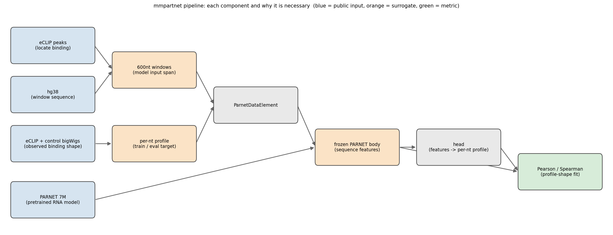
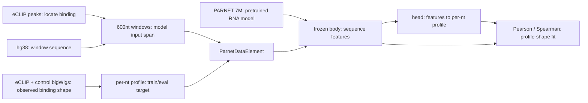
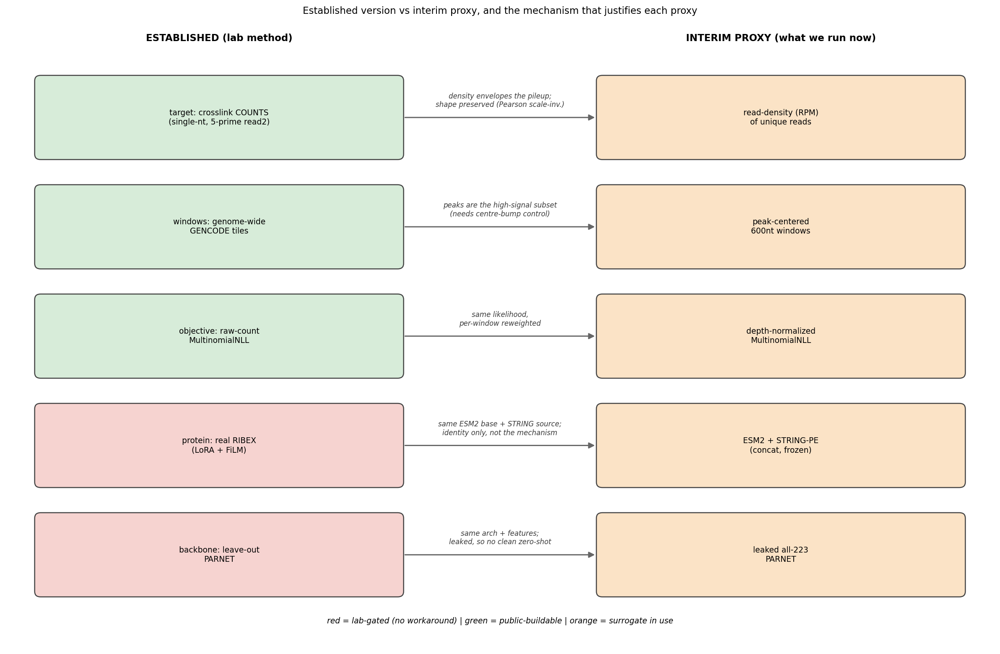
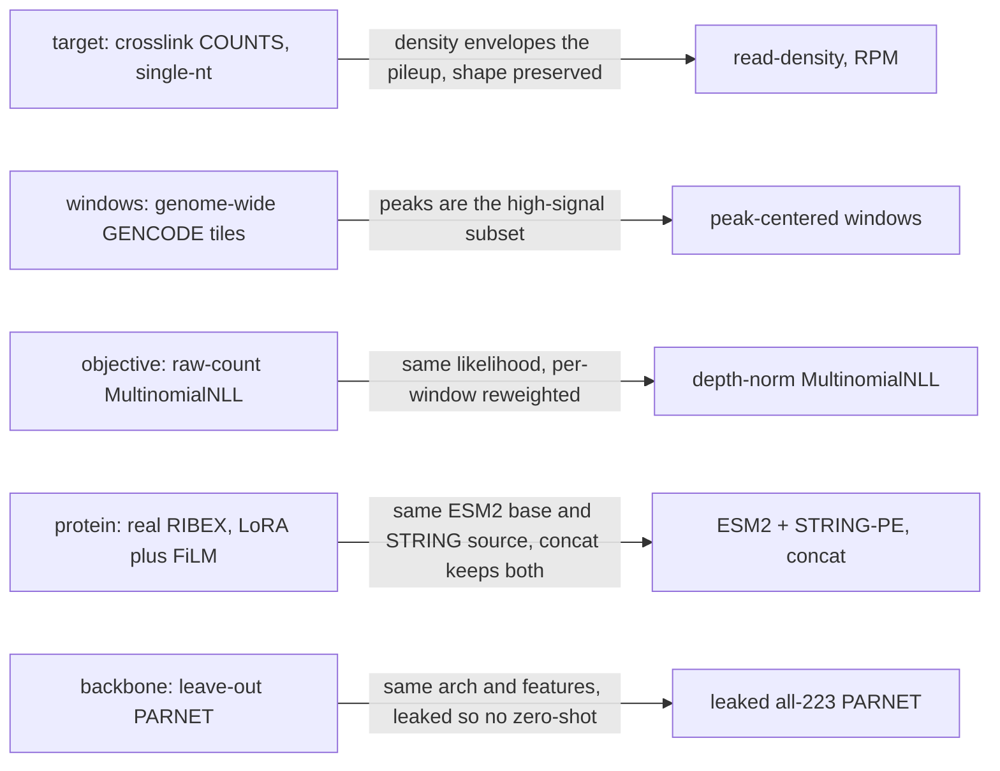

# Data inventory: PARNET demo & MultiModal PARNET

Single source of truth for what each pipeline needs, what we have, what is a surrogate, what is lab-gated,
and (for surrogates) the mechanism that makes each proxy a valid sanity check w.r.t. established methods.
Compiled 2026-06-16 from on-disk assets, `parnet--demo--train-models`, live ENCODE API, and a
Claude-assisted review against cited primary literature (§5). A verification run is in progress (§7), so a
short final pass will follow.

> **For supervisors (priorities).** Using **an a CUDA GPU GPU** we can already make real progress now: every
> surrogate below we can build / work around ourselves. Two pieces have **no temporary workaround**, so they
> are the actual bottleneck: the lab's **leave-out-pretraining PARNET** and **trained RIBEX**. The lab's
> canonical data (counts, genome-wide tiles) is a **nice-to-have** we are still keen on, mainly for
> interpretability and exact 1-to-1 comparison, but it is not blocking.

**Legend:**
- ✅ **Have:** public, established, in hand.
- 🟠 **Surrogate:** proxy in use now, established version is public-buildable (we build it ourselves; see
  §7 verification controls). Mechanism that justifies each proxy is in §4.
- ❌ **Lab-gated:** needs a lab-trained model; no practical public version, i.e. a real blocker.

## 1. Pipeline and why each component is necessary

diagram source (mermaid)

## 2. Established version, and why each can be proxied the way we do (mechanism on the edge)

diagram source (mermaid)

## 3. Data tables

### Table 1: PARNET demo (`parnet--demo--train-models`)

| # | Artifact | What it is | Purpose | Status | Detail / interim proxy |
|---|---|---|---|---|---|
| 1 | Pretrained PARNET 7M | dilated-CNN, RNA to per-nt eCLIP profile, 223 tracks | frozen backbone | ✅ Have | public `mhorlacher/parnet` checkpoint; QKI-verified (all-223; see #9 for zero-shot gate) |
| 2 | `encode.filtered`-equivalent dataset | 600-nt tiles x tracks, per-nt eCLIP counts + control | demo's train/eval input | 🟠 Surrogate | built from #3/#4/#6 (verification task). Lab's canonical = nice-to-have for 1-to-1 comparison |
| 3 | Per-nt eCLIP target | binding profile to predict | ground-truth target (MultinomialNLL) | 🟠 Surrogate | proxy: ENCODE read-density "signal of unique reads". Public-buildable: crosslink counts from ENCODE BAMs |
| 4 | SMInput / control track | per-nt background | AdditiveMix control channel | 🟠 Surrogate | proxy: control read-density (paired exp, e.g. AQR to `ENCSR716AKC`). Public-buildable: control counts |
| 5 | hg38 / GRCh38 | genome FASTA | window sequences | ✅ Have | `hg38.fa` (UCSC) |
| 6 | 600-nt tiles | window definition | where to predict | 🟠 Surrogate | proxy: peak-centered windows. Public-buildable: GENCODE V40 genome-wide tiling |
| 7 | RBP to track-index map | symbol to track index | track selection | ✅ Have | shipped `ENCODE.idx2symbol-cell.pt` |
| 8 | 9-RBP spliceosome-HepG2 subset | name list | which RBPs to finetune | ✅ Have | all present in our manifest |
| 9 | Leave-out-pretraining PARNET | PARNET excluding held-out RBP families | clean zero-shot backbone | ❌ Lab-gated | **no workaround.** proxy is leaked all-223 (saw eval RBPs, so confounded for zero-shot) |

### Table 2: Multimodal extension (not in the demo)

| # | Artifact | What it is | Purpose | Status | Detail / interim proxy |
|---|---|---|---|---|---|
| 1 | RIBEX protein representation | ESM2-650 LoRA + FiLM(STRING PPR-PCA) | protein modality conditioning PARNET | ❌ Lab-gated | **no faithful workaround.** proxy: ESM2 + STRING-PE (concat, frozen); not used in recovery numbers |
| 2 | ESM2 protein embedding | per-RBP protein-LM embedding | rep's sequence backbone | 🟠 Surrogate | component of #1. 640-d, i.e. ESM2-150M's native dim (650M is 1280-d); provenance unconfirmed. Public-buildable: run ESM2-650M |
| 3 | STRING v12 PPI PE | personalized-PageRank graph PE | interactome context (FiLM) | 🟠 Surrogate | component of #1: reduced 64-d PE vs full v12 PPR-PCA. Public-buildable from STRING v12 |
| 4 | RBP amino-acid sequences | UniProt sequences | input to ESM2 | ✅ Have | `sequences*.json` |
| 5 | Leave-out-pretraining PARNET | (= Table 1 #9) | clean zero-shot backbone | ❌ Lab-gated | leaked all-223 stand-in |
| 6 | ATtRACT motifs + RBD families | motif PWMs + family labels | interpretability + OOD axis | ✅ Have | `ATtRACT_db.txt`, `pwm.txt`, `cohort.json` |

## 4. Per-surrogate mechanism (sanity check) and validity, scrutinized

For each surrogate: why it is necessary, the mechanism/relation that lets us proxy it, and a validity verdict
(verified against §5 literature). This is the reasoning that a proxy result is a meaningful sanity check.

| Component | Why necessary | Mechanism leveraged (the sanity check) | Validity (scrutinized) |
|---|---|---|---|
| eCLIP target (#3) | per-nt binding shape to predict and score | crosslink site is ~1 nt upstream of read2 5′ end; read density is a monotone, co-located envelope of the crosslink pileup; target is normalized to a position-distribution, scored by Pearson (location-scale invariant) + Spearman (rank), so window shape is invariant to RPM-vs-raw and density-vs-counts | **Valid as a shape proxy.** Limit: density blurs the single-nt spike, so it can flatter smooth predictions and magnitude is not 1-to-1. Established counts target = control #1 |
| control (#4) | de-bias channel in the additive mixture | SMInput is the experiment's matched background, same coordinate frame, absorbs abundance/sequence bias (RBPNet additive mixture) | **Valid** (correct paired control); inherits the density caveat |
| windows (#6) | 600-nt spans that contain binding | ENCODE narrowPeaks are statistically-called binding regions; same 600-nt length; PARNET is fully-convolutional (position-agnostic); peaks are the high-signal subset the demo's ≥10-read filter keeps anyway | **Valid-with-confound:** peak-centering puts a central bump on every window, so a "predict center" model scores positive without sequence specificity. Needs center-bump baseline + genome-wide tiles (controls 4-5) |
| objective (head) | trainable head with target + control + mix | algebraically the paper's additive mixture π·target+(1−π)·control; per-window read-depth normalization is equal-weighting for Adam conditioning, same multinomial profile likelihood | **Valid-in-structure.** Estimand shifts (equal-window vs count-weighted), π is per-track not per-sequence. Raw-count objective = control #2 |
| protein rep (T2.1) | per-RBP identity to condition on | same ESM2 base carries protein identity from sequence; STRING v12 carries interactome neighborhood; concat keeps both signals linearly available to a head | **Weak / partial.** Supports "an ESM+STRING protein-identity signal exists", NOT RIBEX's mechanism (no LoRA task-adaptation, no FiLM gating); 640-d provenance unconfirmed; not on the recovery's critical path |
| backbone (#9) | RNA feature extractor + finetune baseline | identical architecture + the lab's learned RNA features; for in-distribution RBPs it is the demo's backbone | **Valid in-distribution, invalid zero-shot.** All-223 saw the eval RBPs (leakage), so it cannot give a clean zero-shot result by construction, i.e. one of the two real blockers |

## 5. Primary literature (web-verified)

- eCLIP + crosslink site (5′ of read2): **Van Nostrand et al. 2016, Nat. Methods 13:508** (doi:10.1038/nmeth.3810).
- RBPNet / PARNET (per-nt crosslink-count multinomial + additive SMInput mixture): **Horlacher et al. 2023, Genome Biology 24:180** (doi:10.1186/s13059-023-03015-7); reported avg PCC 0.328, eCLIP inter-replicate ceiling 0.149.
- ESM2 (dims: 150M=640, 650M=1280): **Lin et al. 2023, Science 379:1123** (doi:10.1126/science.ade2574).
- STRING v12: **Szklarczyk et al. 2023, NAR 51:D638**.
- RIBEX (ESM2-650-LoRA + FiLM(STRING PPR-PCA); no weights released): **Firmani et al. 2026, bioRxiv 2026.03.13.711639**.
- ENCODE eCLIP "signal of unique reads" bigWig = RPM-normalized read-density coverage (YeoLab/makebigwigfiles; ENCODE eCLIP SOP).

## 6. Measured results (interim, on surrogate data)

Executed on reconstructed public data (laptop). All on a read-density proxy target, peak-centered windows, a
depth-normalized objective, the leaked backbone, sequence-only (no protein), i.e. they validate the pipeline
and show real, method-grounded signal, but are not number-comparable to the lab's and not zero-shot.

- **Frozen PARNET profile** (`recover_demo_profile`, 12 HepG2 RBPs): mean Pearson **+0.255** vs position-shuffle **+0.002**; all 12 positive; sharp binders (e.g. PTBP1 0.41) rank above diffuse scaffolds (e.g. AQR/SMNDC1 0.13).
- **Head-finetune** (`recover_demo_finetune`, 11 spliceosome RBPs, 323 windows): mean Pearson pretrained **+0.167** to finetuned **+0.400** (delta +0.233), finetuned > pretrained on all 11.

These exceed RBPNet's published PCC (0.328) and the eCLIP reproducibility ceiling (0.149), i.e. they sit in
the regime the method calls success. Caveat: shuffle null is weak and the gain has confounds (center-bump,
depth-normalized objective, leakage), so treat as pipeline-validation plus real-signal evidence, hardened by
§7.

### Executed control verdicts (2026-06-16, a CUDA GPU)

**Profile claim — Controls 1 + 4 (DONE).** 11 spliceosome HepG2 RBPs, nwin=40, frozen pretrained PARNET:

| target | Pearson | shuffle | circular (autocorr) | center-bump | beats center-bump? |
|---|---|---|---|---|---|
| RPM density (proxy) | +0.236 | +0.002 | −0.039 | **+0.614** | NO (−0.378) |
| 5′-crosslink counts (established) | **+0.289** | +0.004 | −0.015 | +0.230 | YES (+0.059) |

The "+0.255 vs +0.002 shuffle = RECOVERED" used a too-weak i.i.d. null. Against the proper nulls: on the
**density proxy** PARNET beats the autocorr-matched circular null but **loses to a constant center-bump**
→ centering-dominated. On the **established crosslink-count target** (strand-validated, counts↔bigWig
corr +0.342) the center-bump confound collapses (+0.614→+0.230) and PARNET **beats every null** (+0.289),
decisively for sharp binders (U2AF2 +0.606, U2AF1 +0.546, PRPF8 +0.395), marginal/below for diffuse
scaffolds (SF3A3 +0.094, AQR +0.101, SMNDC1 +0.170). **VERDICT: profile claim UPGRADED to
established-method-grounded on the COUNT target; the density proxy flatters via centering and must not
carry the headline.** (Controls 4 + 1 wired: `recover_demo_profile.py` circular/center-bump nulls +
`--target counts`; `adapters/eclip_counts.py`.) **Finetune claim (Controls 2+3): running, pending.**

## 7. Verification controls (in progress; mostly IO bound, my internet sucks)

Replacing each surrogate with its established version, on an a CUDA GPU GPU. Controls 3 and 4 are already
wired in code (`recover_demo_finetune.py --baseline randbody`; circular-shift + center-bump nulls in
`recover_demo_profile.py`); a run is in progress, so §6 / §4 verdicts get a final update after.
1. **Established eCLIP target:** re-derive 5′-truncation crosslink counts from public ENCODE BAMs, re-score (target #3, control #4).
2. **Faithful RBPNet objective:** raw-count MultinomialNLL + `additive_mix_max` + log2-balance + min-height (head).
3. **Random-init-head control:** equal-capacity head on a frozen RANDOM body; if it matches, the gain is data-fitting not transfer (backbone/head).
4. **Established nulls:** block / autocorrelation-matched (circular) shuffle + a constant-center-bump baseline (windows #6, metric).
5. **Genome-wide tiles:** build public GENCODE V40 tiling to replace peak-centering (windows #6).

## 8. Request to the lab

We know you are likely busy, so we are keeping this short and self-contained: below are our current
blockers and priorities, framed so you can point us to whatever is quickest on your side. We are doing
everything we can on public data ourselves (§7) and only flag what genuinely needs the lab.

**Main blockers (no temporary workaround; these gate the core science):**
1. **Leave-out-pretraining PARNET** (held-out RBP families excluded). Our backbone is the leaked all-223
   checkpoint, which cannot give a clean zero-shot result by construction, and no public proxy substitutes
   for this. Same checkpoint format as the public 7M, i.e. a one-line swap for us. Unlocks the clean
   held-out-RBP zero-shot benchmark (our core contribution).
2. **Trained RIBEX** representation. Our ESM2+STRING proxy carries protein identity but not RIBEX's
   mechanism (no LoRA/FiLM), so it cannot support a faithful multimodal claim. Minimal form is the per-RBP
   fused embedding vectors (an `.npz`/`.tsv` of `{RBP_symbol: vector}`), or the checkpoint plus a pointer to
   harvest the post-FiLM embedding (`RIBEX/scripts/model_inference.py`). Unlocks faithful multimodal numbers.

**Nice-to-have (not blocking; we are still keen on it):**
- The lab's canonical `encode.filtered` (single-nt crosslink counts over genome-wide GENCODE tiles). We can
  and will build a public equivalent, so this is not a blocker, but the canonical version would give an exact
  1-to-1 comparison with your numbers and cleaner interpretability.

Thank you, and no rush on the nice-to-have; the two blockers are where any pointer would help us most.
